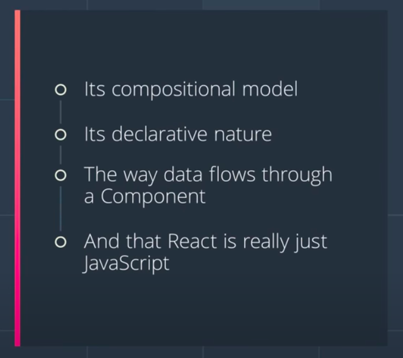

## Git

- Version Control System (VCS)
  - Centrialized (CVCS), ex: Subversion, Team Foundation Server
  - Distributed (DVCS), ex: Git, Bazaar, Mercurial
- Track History and Work together

```zsh
  git config --global user.name "jugshaurya"
  git config --global user.email "shuaryasinghal84@gmail.com"
  git config --global core.editor "code --wait"

  # open file that has global settings for git stored.
  # opens .gitconfig file available @home directory
  git config --global -e

  # making linux and Mac, don't let add carriage return to Line feed @End of Line(EOL)
  git config --global core.autocrlf input # set to "true" for windows to add carriage return to line feed to indicate EOL

  # Initializing a repository
  git init

  # Viewing the status
  git status # Full status
  git status -s # Short status

  # Staging files
  git add file1.js # Stages a single file
  git add file1.js file2.js # Stages multiple files
  git add *.js # Stages with a pattern
  git add . # Stages the current directory and all its content

  # Committing the staged files
  git commit -m “Message” # Commits with a one-line message
  git commit # Opens the default editor to type a long message

  # Skipping the staging area
  git commit -am “Message”

  # List files in Staging area / Index
  git ls-files

  # Removing files
  rm file.js # Removes from working directory only
  git rm file.js # Removes from working directory and staging area
  git rm --cached file.js # Removes from staging area only

  # Renaming or moving files
  git mv file.js file.txt

  # Viewing the staged/unstaged changes
  git diff # Shows unstaged changes
  git diff --staged # Shows staged changes
  git diff --cached # Same as the above

  # Making vscode the default diff tool
  git config --global diff.tool vscode
  git config --global difftool.vscode.cmd "code --wait --diff $LOCAL $REMOTE"
  ##### Now run them instead of git diff #####
  git difftool
  git difftool --staged

  # Viewing the history
  git log # Full history
  git log --oneline # Summary
  git log --reverse # Lists the commits from the oldest to the newest

  # Viewing a commit
  git show <COMMIT ID> #Shows the given commit
  git show HEAD # Shows the last commit
  git show HEAD~2 # Two steps before the last commit => (head-2)th commit

  # Unstaging files (undoing git add)
  git restore --staged file.js # Copies the last version of file.js from repo to index

  # Discarding local changes
  git restore file.js# Copies file.js from index to working directory
  git restore file1.js file2.js# Restores multiple files in working directory
  git restore .# Discards all local changes (except untracked files)
  git clean -fd# Removes all untracked files

  # Restoring an earlier version of a file
  git restore --source=HEAD~2 file.js
```

## Javascript

- High Level, Object Oriented, MultiParadigm Programming Language
- Dynamically Typed
- Prototype-based, object oriented
- Interpreted or Just-in-time Compiled
- Single Threaded
- Garbage Collected
- Has Non-blocking event-Loop concurrency Model.

#### Questions

- One way binding vs two way binding?
- How Virtual Dom Actually works?

- Builds Single Page Application
- Virtual DOM
- React is Declarative
- React is component based
- set of immutable values are passed to the components.(properties flow down; actions flow up.)
- Composition and not Inheritance.
- Hooks are more restrictive than regular functions. You can only call Hooks at the top level of your components (or other Hooks). If you want to use useState in a condition or a loop, extract a new component and put it there.

## React Notes

- A JavaScript library for building User Interfaces.

- Declarative
- Component-Based
- Composition over Inheritance

- Can write directly on

  - codepen
    - create a new pen, and add babel preprocessor, react CDN, react-dom CDN
  - jsbin
    - can write javascript

- React Alternatives

  - Vue
  - Angular
  - Backbone
  - Ember

- With all these libraries/frameworks we can build:

  - Single page apps (only one HTML page, content is rerendered on the Client-side) as well as
  - Multi-page apps (multiple HTML pages, content is rendered on the server and sent to the client-side).

- CRA(create-react-app) (A build Workflow)

  - optimizes code
  - can use latest javascript features/syntax.
  - yarn/npm + webpack bundler + babel transpiler + webpack dev server + hot reloading + many more...

- Class-Based React (before v16) - Oldie

  - always change state via `this.setState({key:updatedValue})`. Just add what you want to update, it will merge the available state with this object and then update to a new state with it.

- Container/stateful/smart componetns
- Component/stateless/dumb/presentational componen

- Interview Questions:-
  - React Interview Questions([RepoLink])

### Composition is:

- Function composition is a mathematical concept that allows you to combine two or more functions into a new function.(_fog(x) and gof(x)_)

- to combine simple functions to build more complicated ones.
- Composition is built from simple functions.
- Composition occurs when simple functions are combined together to create more complex functions. Think of each function as a single building block that does one thing (DOT). When you combine these simple functions together to form a more complex function, this is composition.

## Why React ?



#### React & Composition

React makes use of the power of composition, heavily! React builds up pieces of a UI using components. Let's take a look at some pseudo code for an example. Here are three different components:

```html
<Page>
  <article />
  <Sidebar />
</Page>
```

- When JavaScript code is written imperatively, we tell JavaScript exactly what to do and how to do it.
- **React is Declarative**

  - Imperative code instructs JavaScript on how it should perform each step. With declarative code, we tell JavaScript what we want to be done, and let JavaScript take care of performing the steps.

- Components represent the modularity and reusability of React.
- These component classes should follow the single responsibility principle and just "do one thing"

### Scaffolding Your React App

- JSX is awesome, but it does need to be transpiled into regular JavaScript before reaching the browser. We typically use a transpiler like Babel to accomplish this for us. We can run Babel through a build tool, like Webpack which helps bundle all of our assets (JavaScript files, CSS, images, etc.) for web projects.

- To streamline these initial configurations, we can use Facebook's Create React App package to manage all the setup for us! This tool is incredibly helpful to get started in building a React app, as it sets up everything we need with zero configuration! Install Create React App (through the command-line with npm), and then we can walk through what makes it so great.

- Yarn is a package manager that's similar to NPM. Yarn was created from the ground up by Facebook to improve on some key aspects that are slow or lacking in NPM.

#### create-react-app Recap

- Facebook's create-react-app is a command-line tool that scaffolds a React application. Using this, there is no need to install or configure module bundlers like Webpack, or transpilers like Babel. These come preconfigured (and hidden) with create-react-app, so you can jump right into building your app!

- React encourages us to build applications using _composition instead of inheritance_.
- we need to extend React.Component, but we never extend it more than once. Instead of extending base components to add more UI or behavior, we compose elements in different ways using nesting and props. You ultimately want your UI components to be independent, focused, and reusable.

```
So if you’ve never understood what it means to “favor composition over inheritance” you’ll definitely learn using React!
```

- In a blog post, written by Facebook they had mentioned that they had never used Inheritance in their React code across thousands of components. This shows how just using Composition can solve code reuse problems in React

#### Stateless Functional Components Recap

If your component does not keep track of internal state (i.e., all it really has is just a render() method), you can declare the component as a Stateless Functional Component.

- props represent "read-only" data that are immutable.
- A component's state, on the other hand, represents mutable data that ultimately affects what is rendered on the page. State is managed internally by the component itself and is meant to change over time, commonly due to user input (e.g., clicking on a button on the page).
- Having state outside the constructor() means it is a class field, which is a proposal for a new change to the language. It currently isn't supported by JavaScript, but thanks to Babel's fantastic powers of transpiling, we can use it!
- When defining a component's initial state, avoid initializing that state with props. This is an error-prone anti-pattern, since state will only be initialized with props when the component is first created.

```js
this.state = {
  user: props.user,
};
```

- In the above example, if props are ever updated, the current state will not change unless the component is "refreshed." Using props to produce a component's initial state also leads to duplication of data, deviating from a dependable "source of truth."
- This process of determining what has changed in the previous and new outputs is called Reconciliation.
- How to change the State?
  ```
  we saw how we can define a component's state at the time of initialization. Since state reflects mutable information that ultimately affects rendered output, a component may also update its state throughout its lifecycle using this.setState(). As we've learned, when local state changes, React will trigger a re-render of the component.
  ```

#### There are two ways to use setState().

- The first is to merge state updates. Consider a snippet of the following component:

```js
class Email extends React.Component {
  state = {
  subject: '',
  message: ''
  }
  // ...
});
```

Though the initial state of this component contains two properties (subject and message), they can be updated independently. For example:

```js
this.setState({
  subject: "Hello! This is a new subject",
});
```

- This way, we can leave this.state.message as-is, but replace this.state.subject with a new value.
- The second way we can use setState() is by passing in a function rather than an object. For example:

```js
this.setState((prevState) => ({
  count: prevState.count + 1,
}));
```

- Here, the function passed in takes a single prevState argument. When a component's new state depends on the previous state (i.e., we are incrementing count in the previous state by 1), we want to use the functional setState().

#### setState() Recap

While a component can set its state when it initializes, we expect that state to change over time, usually due to user input. The component is able to change its own internal state using this.setState(). Each time state is changed, React knows and will call render() to re-render the component. This allows for fast, efficient updates to your app's UI.

## Your UI is just a function of your state

for all components, its **UI = f(state)**.

- Functions that are updating the state(let x) in some way must reside in x-state component, not in children or parent.
- **Type checking a Component's Props with PropTypes**
  - As we implement additional features into our app, we may soon find ourselves debugging our components more frequently. For example, what if the props that we pass to our components end up being an unintended data type (e.g. an object instead of an array)? PropTypes is a package that lets us define the data type we want to see right from the get-go and warn us during development if the prop that's passed to the component doesn't match what is expected.
    To use PropTypes in our app, we need to install prop-types:

```
$ npm install --save prop-types
```

Alternatively, if you have been using yarn to manage packages, feel free to use it as well to install:

```
$ yarn add prop-types
```

### Controlled Components Recap

- Controlled components refer to components that render a form, but the "source of truth" for that form state lives inside of the component state rather than inside of the DOM.

##### The benefits of Controlled Components are:

- instant input validation
- conditionally disable/enable buttons
- enforce input formats


- In our ListContacts component, not only does the component render a form, but it also controls what happens in that form based on user input. In this case, event handlers update the component's state with the user's search query. And as we've learned: any changes to React state will cause a re-render on the page, effectively displaying our live search results.
- **Putting it All Into Perspective**
  When it comes to keeping track of data in your app, think about what will be done with that data, and what that data will look like as your user interfaces with your app. If you want your component to store mutable local data, consider using state to hold this information. Many times, it is state that will be used to manage controlled form elements in your components.
- On the other hand, if some information isn't expected to change over time, and is generally designed to be "read-only" throughout your app, consider using props instead. Both state and props will generally be in the form of an object, and changes in either will trigger a re-render of the component, but they each play very different roles in your app.
- render() is only used for displaying content, we put the code that should handle things like Ajax requests in what React calls lifecycle events.

### Lifecycle Events


Lifecycle events are specially named methods in a component. These methods are automatically bound to the component instance, and React will call these methods naturally at certain times during the life of a component. There are a number of different lifecycle events, but here are the most commonly used ones.

> componentDidMount()
>
> > invoked immediately after the component is inserted into the DOM
> > componentWillUnmount()
>
> > invoked immediately before a component is removed from the DOM
> > getDerivedStateFromProps()
>
> > invoked after a component is instantiated as well as when it receives brand new props

- To use one of these, you'd just create a method in your component with the name and React will call it. It's an easy way to hook into different parts of the lifecycle of React components.

- The lifecycle event that we'll be looking at (and will be using a lot in our app!) is the **componentDidMount()** lifecycle event.

- You'll sometimes see **shouldComponentUpdate()** in React apps as well. It returns true by default. This means that whenever a component's state (or its parent's state) is updated, the component re-renders.

- The React documentation provides the following guidance for using this lifecycle event:

  - The default behavior is to re-render on every state change, and in the vast majority of cases you should rely on the default behavior.
  - Do not rely on it to “prevent” a rendering, as this can lead to bugs.
  - Consider using the built-in **PureComponent** instead of writing shouldComponentUpdate() by hand.
    We do not recommend doing deep equality checks or using JSON.stringify() in shouldComponentUpdate(). It is very inefficient and will harm performance.

## Now, there are a number of different lifecycle events.

They will run at different points, but we can break them down into three distinct categories:

### 1. Adding to the DOM

The following lifecycle events will be called in order when a component is being added to the DOM:

```js
constructor();
getDerivedStateFromProps();
render();
componentDidMount();
```

⚠️componentWillMount() has been deprecated. ⚠️
As of React 16.3, componentWillMount() has been replaced with UNSAFE_componentWillMount(). Only UNSAFE_componentWillMount() will work starting with React 17.0. UNSAFE_componentWillMount() is now considered to be a legacy method and should not be used in new code.

### 2. Re-rendering

The following lifecycle events will be called in order when a component is re-rendered to the DOM:

```js
getDerivedStateFromProps()
shouldComponentUpdate()
render()
getSnapshotBeforeUpdate()(specific use cases)
componentDidUpdate()
```

⚠️componentWillReceiveProps() and componentWillUpdate() have been deprecated. ⚠️
As of React 16.3, they have been replaced with UNSAFE_componentWillUpdate() and UNSAFE_componentWillReceiveProps(). Only UNSAFE_componentWillUpdate() and UNSAFE_componentWillReceiveProps() will work starting with React 17.0. UNSAFE_componentWillUpdate() and UNSAFE_componentWillReceiveProps() are now considered to be legacy methods and should not be used in new code.

### 3. Removing from the DOM

This lifecycle event is called when a component is being removed from the DOM:

```js
componentWillUnmount();
```

Footer

## Learn React

- UI DEV React Course
- Academind React Course

## Testing

- Testing react with jest and React Testing Library
- React Testing Library
- Kent C. Dodds

# React Router

##### Single-Page Apps

- Single-page applications can work in different ways. One way a single-page app loads is by downloading the entire site's contents all at once. This way, when you're navigating around on the site, everything is already available to the browser, and it doesn't need to refresh the page. Another way single-page apps work is by downloading everything that's needed to render the page the user requested. Then when the user navigates to a new page, asynchronous JavaScript requests are made for just the content that was requested.

- Another key factor in a good single-page app is that the URL controls the page content. Single-page applications are highly interactive, and users want to be able to get back to a certain state using just the URL. Why is this important? Bookmarkability! (pretty sure that's not a word...yet) When you bookmark a site, that bookmark is only a URL, it doesn't record the state of that page.

#### React Router

- React Router turns React projects into single-page applications. It does this by providing a number of specialized components that manage the creation of links, manage the app's URL, provide transitions when navigating between different URL locations, and so much more.

  > According to the React Router website:

  > React Router is a collection of navigational components that composes declaratively with your application.

  ```
  npm install --save react-router-dom
  ```

## <BrowserRouter\/>

- going to listen for the changes in url, and make sure correct screen shows up when url changes.

- Here is the code straight from the React Router repository.

  ```js
  class BrowserRouter extends React.Component {
    static propTypes = {
      basename: PropTypes.string,
      forceRefresh: PropTypes.bool,
      getUserConfirmation: PropTypes.func,
      keyLength: PropTypes.number,
      children: PropTypes.node,
    };

    history = createHistory(this.props);

    render() {
      return <Router history={this.history}                  children=this.props.children} />;
    }
  }
  ```

- When you use BrowserRouter, what you're really doing is rendering a Router component and passing it a history prop. Wait, what is history? history comes from the history library (also built by React Training). The whole purpose of this library is it abstracts away the differences in various environments and provides a minimal API that lets you manage the history stack, navigate, confirm navigation, and persist state between sessions.

- So in a nutshell, when you use BrowserRouter, you're creating a history object which will listen to changes in the URL and make sure your app is made aware of those changes.

- Link is a straightforward way to provide declarative, accessible navigation around your application. By passing a to property to the Link component, you tell your app which path to route to.

  ```js
  <Link to="/about">About</Link>
  ```

- If you're experienced with routing on the web, you'll know that sometimes our links need to be a little more complex than just a string. For example, you can pass along query parameters or link to specific parts of a page. What if you wanted to pass state to the new route? To account for these scenarios, instead of passing a string to Links to prop, you can pass it an object like this,

  ```js
  <Link
    to={{
      pathname: "/courses",
      search: "?sort=name",
      hash: "#the-hash",
      state: { fromDashboard: true },
    }}
  >
    Courses
  </Link>
  ```

- with a Route component if you want to be able to pass props to a specific component that the router is going to render, you'll need to use Route’s render prop. As you saw, render puts you in charge of rendering the component which in turn allows you to pass any props to the rendered component as you'd like.

  ```javascript

  <Route to="/" component={Alpha} />
  <Route to="/" render={(props) => <Alpha {...props} />} />

  ```

- In summary, the Route component is a critical piece of building an application with React Router because it's the component which is going to decide which components are rendered based on the current URL path.

### React Native

### TypeScript

- Programming languages divide into two categories: statically-typed and dynamically-typed.
- In statically-typed languages (eg C++, C#, Java, etc), the type of variables is set at compile-time and cannot change later.
- In dynamically-typed languages (eg Python, JavaScript, Ruby), the type of variables is determined at run-time and can change later.
- TypeScript is essentially JavaScript with static typing and some additional features that help us write more concise and robust code.
- Most IDEs and code editors supporting TypeScript provide incredible IntelliSense and auto-completion. So we get active hints as we code. A great productivity booster!
- By providing type information in our code, we get better refactoring support in most IDEs and code editors.
- With TypeScript we can catch more bugs at compile time.
- Browsers don’t understand TypeScript code. So we need to use the TypeScript compiler to compile and translate (or transpile) our TypeScript code into regular JavaScript for execution by browsers.
- `Source maps` are files that represent the mapping between TypeScript and JavaScript code. They’re used for debugging.
- We can configure the TypeScript compiler by enabling/disabling various settings in tsconfig.json
- Since TypeScript is a superset of JavaScript, it includes all the built-in types in JavaScript (eg `number, string, boolean, object, null, undefined`) as well as additional types (eg `any, unknown, never, enum, tuple`, etc).
- In TypeScript, we set the type of our variables by annotating them.
- The `any` type can represent any kind of value. It’s something we should avoid as much as possible because it defeats the purpose of using TypeScript in the rst place. A variable of type any can take any kind of value!
- `Tuples` are fixed-length arrays where each element has a specific type. We often use them for representing two or three related values.
- `Enums` represent a list of related constants.

```ts
// Annotation:
let sales: number = 123_456_789;
let numbers: number[] = [1, 2, 3];

// Tuples:
let user: [number, string] = [1, "Mosh"];

// Enums:
enum Size {
  Small = 1,
  Medium,
  Large,
}
// Enum with const => generates optimized code in js file.
const enum Size2 {
  Small = 1,
  Medium,
  Large,
}

// Functions:
function calculateTax(income: number): number {
  return income * 0.2;
}

// Objects:
let employee: {
  id: number;
  name: string;
  retire: (date: Date) => void;
} = {
  id: 1,
  name: "Mosh",
  retire: (date: Date) => {},
};
```

- Using a type alias we can create a new name (alias) for a type. We often use type aliases to create custom types.

```ts
// Type alias
type Employee = {
  id: number;
  name: string;
  retire: (date: Date) => void;
};
```

- With union types, we can allow a variable to take one of many types (eg number | string).

```ts
// Union types
let weight: number | string = 1;
weight = "1kg";
```

- With intersection types, we can combine multiple types into one (eg Draggable & Resizable).

```ts
// Intersection types
type Draggable = { drag: () => void };
type Droppable = { drop: () => void };

type UIWidget = Draggable & Droppable;

const MenuBox: UIWidget = {
  drag: () => {
    /* ... */
  },
  drop: () => {
    /* ... */
  },
};

// Literal types
type Quantity = 50 | 100;

// Nullable types
let name: string | null = null;
```

- Using `optional chaining` `(?.)` we can simplify our code and remove the need for null/undefined checks.

```ts
// Optional chaining (?.)
customer?.birthdate?.getFullYear();
customers?.[0];
log?.("message");
```

- Using the `Nullish Coalescing Operator` (`??`), we can fallback to a default value when dealing with null/undefined objects.

```ts
// Nullish coalescing operator
let speed: number | null | undefined = null;
let ride = {
  // speed: speed || 30; // error when speed is 0 => speed will be set to 30, as 0 is falsy in JS.
  // speed: speed != null ? speed : 30, // have to use this
  // Both are equivalent
  speed: speed ?? 30,
};
```

- Sometimes we know more about the type of a variable than the TypeScript compiler. In those situations, we can use the `as` keyword to specify a different type than the one inferred by the compiler. This is called `type assertion`.
- The `unknown` type is the type-safe version of any. Similar to any, it can represent any value but we cannot perform any operations on an unknown type without first narrowing to a more specific type.

```ts
// The unknown type
function render(document: unknown) {
  // We have to narrow down to a specific type before we can perform any operations
  // on an unknown type.
  if (typeof document === "string") {
  }
}
```

- The `never` type represents values that never occur. We often use them to annotate functions that never returns or always throw an error.

```ts
// The never type

// This function never returns because it has an infinite loop.
function processEvents(): never {
  while (true) {}
}

function onlyThrowsError(): never {
  throw new Error("error");
}
```
