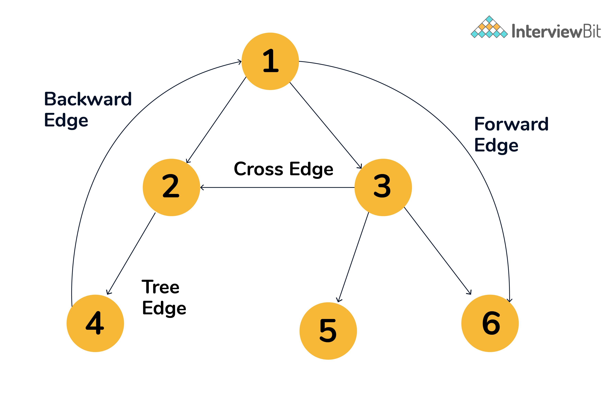

##### Graph Data Structure G(V,E)

### 1. Terminology

- **Undirected Graph** (Unordered Edge Pair)
- **Directed Graph** (digraph)(Ordered Edge Pair)
- **Weighted Graph**
- **Unweighted Graph**
- **Bridge or cut edge or cut-arcs**
  - An edge removal that either disconnects the connected graph or increases the number of connected components in a graph is called Bridge.
  - Important in graph theory because they often hint at weak points , bottlenecks or vulnerabilities in a graph.
- **Articulation Point or cut vertices**
  - Vertex removal of which either disconnects the connected graph or increases the number of connected components in a graph is called cut vertex.
  - Important in graph theory because they often hint at weak points , bottlenecks or vulnerabilities in a graph.
- **Biconnected Graph**
  - If removal of any one vertex doesn't disconnect the graph, the graph is called biconnected (connected through 2 ways).
- **If a graph is connected** then
  - Minimum no. of edges = `n-1` => Tree
  - Maximum no. of edges in `Undirected` = <code><sup>n</sup>C<sub>2</sub></code>
  - Maximum no. of edges in `Directed` = <code> 2<sup>n</sup>C<sub>2</sub></code> 
- **Simple Graph**
  - Graph **without** `self loops` and `multiple edges b/w two vertices.`
- **Handshaking Theorem**
  - 2 * No. of edges = 2 * |E| = Sum of degrees of all vertices.
    - => Sum of degrees is always even.
    - => Number of odd degree vertices is always Even in number.
  - In Directed graphs, sum of Indegree = sum of Outdegree = |E|.
- **Walk**
  - A physical link & can repeat the way while walking.
  - [v1, v2, v3, v5, v1, v2] is a walk.
  - [v1, v2, v3, v5, v4] is a walk.
- **Path**
  - A physical link where vertices repetition is not allowed.
  - Note: If vertices are not repeated, edges can't repeat as well.
  - A path is a walk without repeated vertices and thus no repeated edges.
  - [v1, v2, v3, v5, v1, v2] is not a path.
  - [v1, v2, v3, v5, v4] is a path. (No repetition)
- **Trial**
  - A trial is a walk without repeated edges.
  
  ```
          Walk
          /  \
      Path   Trial (<--subcategories)
  ```

- **Eulerian path**
  - a path that covers every **edge** exactly once. (e and E matches).
  - hierholzer's algorithm O(V+E) for finding Eulerian Circuit(cover all edges without lifting the pen).
  - Condition that there exist a Euler Circuit
    - 1. Graph should be connected.
    - 2. Graph must have `all even degree vertices` or `(n-2)even and 2odd degree vertices`.
  - If all are even degree, you can start from any vertex, you will surely get a Euler Circuit.
  - If 2 odd and rest even, start from any of two odd degree vertices.
- **Hamiltonian path**
  - a path that covers all vertices exactly once.
  - DP Problem

### 2. Special Graphs

  - **Tree** is an Acyclic Connected Undirected Graph.
  - **Rooted Trees** **TODO** image 1
    - A Rooted Tree is a tree with a designated root node where every edge either points towards or away from the root node.
    - When edges point away from the root, the graph is called a arborescene(out-tree) and anit-arborescene(in-tree) otherwise.
  - **Directed Acyclic Graphs(DAG)**
    - Directed Graphs with no cycle.
    - Represents structures with deependencies.
    - All out-trees are DAG but not all DAGs are out-trees.
  - **Bipartite Graph**
    - We can divide all vertices into two sets such that all edges of the graph are from one set to another set.
    - Either we can check for an odd-length cycle. `A graph is Bipartite if it has no odd-length cycle`.
      - => Every tree is Bipartite.
      - => Every DAG is Bipartite.
    - Or we color nodes and see if violation occurs or not.
    - 2 colorable graphs[Bichromatic] are bipartite (=> chromatic Number of such graph is 2).
    - Notation: <code>K<sub>n,m</sub></code> for Bipartitie Graphs, whereas Complete graph notation is <code>K<sub>n</sub></code>

### 3. Graph Representations

- **Adjacency Matrix**
  - Space: <code>O(V<sup>2</sup>)</code>
  - Operations:
    - Check if u and v are adjacent is O(1).
    - Finding vertices adjacent to u is O(V).
    - Finding degree of u is O(V).
    - Add/Delete an edge is O(1)

- **Adjacency List**
  - Space: `O(V+E)` [ V for array size and E for total list size in chaining.]
  - can be Implemented using dynamic size 2D-array(vector) or linked list.
  - Operations:
    - Check if u and v are adjacent is O(degree(u)=V).
    - Finding vertices adjacent to u is O(degree(u)=V).
    - Finding degree of u is O(1) `as internal arrays size is stored in v.size()`.
    - Add/Delete an edge is O(1)/O(V), depending upon implementation.
  - Example
    - `vector<int> adjList[V]` (array of vectors).
    - or `unordered_map<int> adjList[V]` (array of hashmaps).
    - or `vector<vector<int> > v` (vector of vectors). (Preferred)
    - or `vector<list<int> > v` (vector of list).
    - or `unordered_map<vector<int> > v` (hashmap of vectors).
    - or `unordered_map<list<int> > v` (hashmap of lists).

- **Edge List**
  - Used when we required sorting based on edge weights like in Finding MST in Krushkal.
  - [(0,3) is an edge,(0,2) is an edge,(1,4) is an edge,(2,4) is an edge]
  - [list/vector/array] of pair(src, dest)
  - [list/vector/array] of triplet(weight, src, dest)

- **Implicit Graph**
  - Graph given in form of 2d Matrix 
    - `4 way connectivity` (movement can be top, right, down, left) or
    - `8-way connectivity` (All 8 directions to move).
    - `cells sharing edge` => 4 way connectivity (top, right, down, left).
    - `cells sharing corner` => 4 way connectivity (top-left, top-right, bottom-left, bottom-right).
    - `cells sharing edges and corner` => 8 way connectivity.

> ##### Points to Remember: 
  - ⭐️ The adjacency list is far more suited than the Adjacency matrix as most of the scenarios in real life have sparse graphs.
  - ⭐️ **Handling vertices with a value other than integer like strings (the name of the city):-**
    - We store the city name and an index in a hashmap. (So that finding the index from city name is constant.)
    - along with index and city name in the array. (So that finding city name from an index is constant.)
  - ⭐️ In Graph Problems, we need to mark things `visited`, so that next time if we come back to the same thing we know that we already came there once and not stuck in infinite loop.


### 4. Graph Traversals

- **DFS** O(V+E)

```cpp
  void dfs(int node){
    visited[node] = 1;
    for(auto nbr: g[node]){
      if(!visited[nbr]) dfs(nbr);
    }
  }
```

- **BFS** O(V+E)

```cpp
  void bfs(int x){
    queue<int> q;
    vector<int> visited(V,0);
    q.push(x);
    visited[x] = 1;

    while(!q.empty()){
      auto f = q.front(); q.pop();

      for(auto nbr: g[f]){

       if(!visited[nbr]){
         q.push(nbr);
         // important: visited[x]=1 means either in queue, or we have explored everything about x and done with it.
         // should mark it visited as soon as we put nbr in queue. 
         // Why? If we mark nbr visited at the time of popping from queue, it may be pushed to queue multiple number of times, which may lead to TLE.
         visited[nbr] = 1; 
       } 
      }
      // .... do other work
    }
  } 
```

### 5. Cycle Detection [can use BFS or DFS or DSU].

- **For Undirected graphs**
  - **Using BFS or DFS**
    - Check for any vertex, if any neighbour vertex is already visited or not but ignore the parent vertex.
    - `Conclusion: Check for vertices visitation except for the parent one.`

  - **Using DSU** 
    - while making the graphs, find if any edge's both vertices belong to the same set or not.
    - DSU exists only for undirected Graphs.

- **For Directed graphs**:

  - Undirected Algorithm (previous point) fails for `3 --> 1 <-- 2` graph. (for loop will go to 1 and mark it visited, then goes to 2 and see 1 is visted and it is not the parent and decalre cycle exist. But it doesn't exist, similarly for 3).

  - **using DFS:** 
    - we look for the back edge, which means while doing DFS we check if an neighbour vertex is already available in the recursion stack or not (maintains a boolean array for what we have pushed to stack till now)(or we can use visited array for same, 0 means not visited, 1 means visited but not in stack, 2 means visited for current going on recursion stack/in the stack).
    - Same can also work in Undirected graphs(above case) But Leave parent vertex here as well(right? Yes).
    - `Conclusion: check for back edge,i.e. Is vertex already in recursion-stack ?`
  
  - **using BFS:** 
    - `Kahn's Algo` for Topological Sorting. If after doing Kahn's algo onto a graph. If some vertex is still not visited => cycle exist.(see below on the page for more clarity).

  - [**DSU cann't be use here**](https://stackoverflow.com/questions/61167751/can-we-detect-cycles-in-directed-graph-using-union-find-data-structure)
    - a directed graph cannot be represented using the disjoint-set. 

> ##### Points to Remember: **Backedge** 
  - While doing dfs, if a vertex points to the node in the call stack, then it is a back edge.
  - and if at least one back edge exists in a graph, then it always contains a cycle.   

### 6. Shortest Distance Algorithms
  - _Single Source Shortest Path (SSSP)_
    
    - **BFS Algorithm** <code>O(V+E)</code>
      - helps in finding the shortest path b/w u and v in an `unweighted or equal weighted` Graph.
      - Works for both Directed and Undirected graphs.
        - Shortest path b/w u and v in a weighted Graph is done using Dijkstra, which is similar to BFS, rather than a queue, it uses a priority queue/ordered_set to pick the node with minimum weight from current node out of all the available options.
    
    - **0-1 BFS** <code>O(V+E)</code>
      - Find single source shorted paths to all nodes with edge weights of 0 or 1.
      - uses deque

    - **Dijkstra's Algorithm** <code>O((V+E)logV) = O((V+E)logE)</code>
      - we try to fix the distances we can from source.
      - (can may or may not fails on -ve weighted edges). But it is safe to assume that if question says it has negative edge weights, dont use Dijkstras.
        - Works on TODO image
        - Doesn't Works on TODO image
      - (surely fails on -ve weighted cycle).

    - **Bellman's Ford Algorithm** <code>O(V\*E)</code>
      - relax all the edges |V| -1 number of times.
      - ⭐️ Both Bellman and Floyd Algorithms can **detect** the negative weight cycle.

  - _All Pair Shortest Path(APSP)_
    - **Floyd Warshall Algorithm** <code> O(V\*V\*V) = O(V^3)</code>
      - requires adacency matrix only.
      - fills the 2D-distance matrix via a dp solution.
      - initialize matrix with large values , Infinity.
      ```cpp
        for k(0,V):
          for i(0,V):
            for j(0,V):
              dist[i][j] = min(dist[i][j], dist[i][k] + dist[k][j]); 
      ```

### 7. MultiSource BFS

1. push all the sources into the queue and do the BFS.
2. Used when need to find the shortest distance from multiple points (feels like spreading of the virus to neighbors one at a time).

### 8. 0-1 BFS

- `uses deque` instead of queue, and pushes to front if weight is 0 else push it to back.
- It is like Dijkstra's Algo only, since we have only 2 type of weights here, we dont need to maintain a set to keep the data sorted inside queue. we can simply push 0 weight nodes in front and 1 in end. that will keep it sorted as needed in dijkstras.Hence we use Deque datastructure.
- `don't use visted array, use dist array` as in 0-1BFS, every node can be put into queue atmost 2 times. Visited will not let u push a node more than once.
- while checking for is neighbour visited. Check if distance can be relaxed or not. and push into queue only if it is possible to do so.

```cpp
int n,m;
vetor<pair<int,int>> g[100100];
int dis[100100];

void BFS01(int src){
  deque<int> dq;
  for (int i = 0; i < n; i++) {
    dis[i] = 1e9;
  }

  dis[src] = 0;
  dq.push_back(src);
  while(!dq.empty()){
    int f = dq.front();
    dq.pop_front();

    for(auto x: g[f]){
      int neigh = v.first;
      int weigh = v.second;
      // visitation/Relaxation condition
      if(dist[x] > dist[f] + weight){
        dist[x] = dist[f] + weight;
        if(weight==0){
          dq.push_front(neigh);
        }else{
          dq.push_back(neigh);
        }
      }
    }
  }
}

void solve(){
  // take input
  BFS01(src);
}
```

### 9. Topological sorting

  - Works only for DAG
  - via **BFS (Kahn's Algorithm)** - remove the node with in-degree 0. keep doing it.
    - Kahn is useful in the cases where we are finding topological in a Directed `cyclic` graph.
    - because nodes present in a Directed cycle will never have indegress==0 and hence it will not go into the queue. and hence remains unvisited. => we can detect the nodes that are a part of a cycle. and if some node is unvisited that means there exists at least a cycle in a graph. 
    ```cpp
      int n,m;
      vector<int> gr[100100];
      int indegree[100100];
      vector<int> topo;

      // kahn's Algorithm
      void kahn(){
        queue<int> q;
        for(int i=0;i<n;i++){
          if(indegree[i]==0) q.push(i);
        }

        while(!q.empty()){
          int f = q.front();
          q.pop();
          topo.push_back(f);
          for(auto v: gr[f]){
            indegree[v]--;
            if(indegree[v]==0) q.push(v);
          }
        }
      }

      void solve(){
        cin>>n,m;
        for(int i=0;i<n;i++){
          int a,b;
          cin>>a>>b;
          gr[b].push_back(a)
        }

        for(int i=0;i<n;i++){
          if(!vis[i]){
            dfs(i);
          }
        }

        bool isCyclePresent = false;
        for(int i=0;i<n;i++){
          if(!vis[i]){
            isCyclePresent = true;
          }
        }

        if(isCyclePresent) {
          cout<<"Cycle Is Present";
          return;
        }

        reverse(topo.begin(), topo.end());        
      }

    ```
  - via **DFS** - Save the nodes when none of their neighbors remained to be visited. print output in reverse order.

  ```cpp
    vector<int> topo;
    vector<int> visited;
    void dfs(int node){
      visited[node] = 1;
      for(auto nbr: gr[node]){
        if(!visited[nbr]){
          dfs(nbr);
        }
      }
      topo.push_back(node);
    }

    solve(){
      int src; cin>>src;
      visited = vector<int>(V,0);

      for (int i = 0; i < V; i++) {
        if(!visited[i]) dfs(src); 
      }
      reverse(topo.begin(), topo.end());
    }
  ```
    - can save in a list and use push_front to save the node(basically appendToHead). and then print the list.
    - can save it in the stack and then print the stack.
  - Application of Topological sorting:-
    - 1. Finding Lexiographically smallest Topological ordering.
      - Use Kahn's Algo but instead of a queue, use priority queue/set.
    - 2. Finding Longest path in DAG.
      - Why? Since in DAG, all edges are toward the right of a topological ordering.
      - We can use Dynamic Programming, to store the longest path startting at node i, where i moves backwards from last node in topo order to 1st node.
      - I.e dp[i] = 1 + max(dp[j]); for all j where there is an edge from i to j(means neighbour of i).
      - answer will be the max of all of it.

### 10. DSU (Disjoint Set Union)/(Union and Find)

  - [⭐️ DSU exists only for undirected Graphs.](https://stackoverflow.com/questions/61167751/can-we-detect-cycles-in-directed-graph-using-union-find-data-structure)
  - Union and Find both complexities will be O(V).
    - One Find(A) will be O(V).
  ```cpp
    // initially parent of all vertices is -1.
    vector<int> parent(V,-1); 
    int find(int idx){
      if(parent[idx]==-1) return idx;
      return find(parent[idx]);
    }
  ```
    - One Union(A,B) will be O(V). [btw, union internally uses find()]
  
  ```cpp
    // initially parent of all vertices is -1.
    vector<int> parent(V,-1); 
    int find(int idx){
      if(parent[idx]==-1) return idx;
      return find(parent[idx]);
    }

    void union(int idx1, int idx2){
      int p1 = find(idx1);
      int p2 = find(idx2);
      if(p1!=p2) parent[p1] = p2; // can be parent[p2] = p1; as well.
      // else they belong to the same set dont do anything -> Cycle !!!
    }
  ```
  - Optimizations making DSU O(1) amortized, Proof not discussed.
    - Path Compression
      - Name says it all
      - just one change in find fn(), return parent[idx] = find(parent[idx]);
      ```cpp
        int find(int idx){
          if(parent[idx]==-1) return idx;
          // path compression
          return parent[idx] = find(parent[idx]);
        }
      ``` 
      - Example let the graph be like this: 
      ```diagram
             3
            / \
            4  2
            /   \
            5    1
            /   
            6
      ```
      - while finding out the ultimate parent of 6, we make 4, 5,6 direct children of 3 and return 3(see code).
      ```diagram
                3
             / / / \
            4 5 6   2
                     \
                      1
      ```
    - Union By Rank
      - while doing the set union, attach smaller tree on to bigger one and not vice-versa so that whiel finding out the ultimate parent of a vertex, path traversal remains smaller and not increased.
      - to find out which tree is bigger, we add extra variable to every vertex, which say subtree(s) size of the vertex(how many children, called `rank` are attached to a node, so that while doing union, we connect lower rank vertex to higher).
      - Example: let skew tree be 4-->3-->2-->1 and 5-->6, here we make 1 as parent of 5 and not vice versa, because 1 has 3 more children whereas 5 has only one. If we would have done vice-versa, then finding ultimate parent of 2,3,4 would have increased by one. 
      ```cpp
       // initially parent of all vertices is -1.
      vector<int> parent(V,-1); 
       // initially rank of all vertices is 1.
      vector<int> rank(V,1); 
      int find(int idx){
        if(parent[idx]==-1) return idx;
        // path compression optimization
        return parent[idx] = find(parent[idx]);
      }

      void union(int idx1, int idx2){
        int p1 = find(idx1);
        int p2 = find(idx2);
        if(p1!=p2) {
          // union by rank optimization
          if(rank[p1]<rank[p2]){
              // means p1 has less chilren => 
              parent[p1] = p2;
              // children of p2 increases by rank(p1)
              rank[p2]+= p1;
          }else{
              parent[p2] = p1;
              rank[p1] += rank[p2]
          }
        }
      }
      ```


### 6. Spanning Tree

  - concept for Undirected Graphs only. Is it?
  - A graph can have multiple spanning trees.
  - A graph can have multiple Minimum spanning trees but of equal lengths. because of minimum
    - Example: An unweighted graph(w=1 for every edge) has multiple MSTs of length (#nodes-1)

#### Properties of Spanning trees(ST)/MST
  - #edges in ST = V-1.
  - Spanning Trees is maximally acyclic => If we add one more edge to ST, the graph will have a cycle.
  - Spanning Trees is minimally connected => If we remove one edge from ST, the graph will become disconnected.
  - There may exist many STs of the same weight.
  - If each edge has a distinct weight, then we will have exactly one unique MST.
  - Cycle Property: For any Cycle C in a graph, if the edge weight is larger than all other edges in C. Then that edge cannot be a part of MST.
  - Min-cost-edge: If the minimum weighted edge in Graph is Unique, Then it will always belong to MST.

##### Finding MST

  - Prims and Kruskal's Algorithms
  - `Kruskal's Algorithms (For Undirected Graph)`
    - Greedy Algo, `Complexity O(E*logE)` ; as E = V^2 => logE = 2LogV => `Complexity O(ElogV)`
    - `space complexity: O(V+E)`, 
      - O(V) to maintain rank and parent array in union find.
      - and O(E) to store and sort edges by weight.
    - It Picks Edges one by one
    - Uses `Union Find` Data structure (DSU : Disjoint Set Union)
    - `Sorts edges` in non-decreasing order by weight
    - Pick the edge(u> v) if it is not forming a cycle. i.e u and v belong to different sets.
  
  - `Prim's Algorithm (For Undirected Graphs)` O(ElogE) = O(ElogV)
    - Uses Min Heap/set to find the minimum of edge weights.
    - `space complexity: O(V+E)`, 
      - O(E) to maintain heap. 
      - and O(V+E) to maintain the graph.
    - Also a Greedy Approach.
    - It starts from the source vertex, adds respective edges into a set, finds one with minimum weight(selected-edge) and adds to MST, further adds edges of selected-edges-end-vertex into a set, and so on(if the set gives an edge whose endpoints are already covered into MST, we leave that edge, because if we choose that edge, it will create cycle).
  - Prim's algorithm is significantly faster in the limit when you've got a really dense graph with many more edges than vertices. Kruskal performs better in typical situations (sparse graphs) because it uses simpler data structures and sorts edge lists.

## Articulation Points(CutPoint) and Bridges

- Discovered Time
- Lowest Time
- Edge is Bridege: If lowestTime[child] > DiscoveredTime[currentNode]
- vertex is a cutpoint: If lowestTime[child] >= DiscoveredTime[currentNode]
  - Special Case: Root is cutpoint, if number of child in a DFS tree of graph is > 1.


### Strongly Connected Digraphs (Connectivity in Directed Graph)

  - Directed graph is strongly connected if there exists a **Directed path** b/w every pair of vertices.
  - And components that are strongly connected are called Strongly connected Components of a Graph.
  - 
  - Strongly Connected component <=> Directed Cycle insided graph.
  - There can exist multiple SCC inside a graph.**TODO** image 2
  - Condensed Connected Graph
  - Algorthsm: Tarjan's and Kosaraju's Algortihms

### DFS Tree of a graph


- Type of Edges
  - Tree Edge: The edge which is present in the tree obtained after applying DFS on the graph.
  - Forward Edge: Edge (u, v) such that v is descendant but not part of the DFS tree. The edge from node 1 to node 6 is a forward edge.
  - Back edge: Edge (u, v) such that v is an ancestor of edge u but not part of the DFS or BFS tree. The edge from node 4 to node 1 is a back edge.
    -  Presence of the back edge indicates a cycle in the Directed graph.
  - Cross Edge: It is an edge that connects two nodes such that they do not have any ancestor and a descendant relationship between them. The edge from node 3 to node 2 is a cross edge.


- DFS can be used to find Articulation Points and Bridges.


### Later

- LCA
- Binary Lifting
- Euler Tour
- Network Flow


### Weakly Connected Graph

  - Directed Graph which is not strongly connected, But If we remove the direction of edges and it becomes a Connected graph. then it is weakly connected.

## Network Flow: 

- Algortihms: Ford-Fulkerson, Edmonds-Karp & Dinic's Algorithm