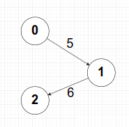
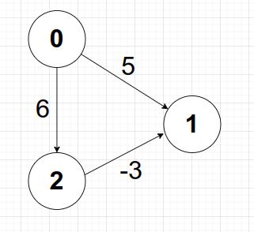
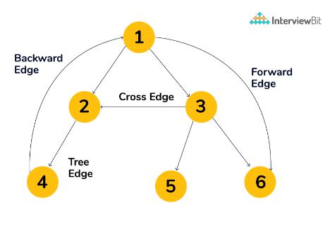
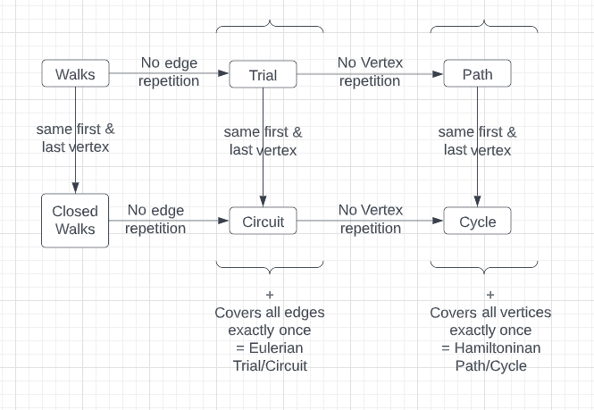
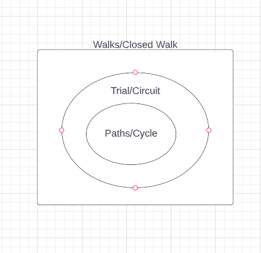

## Graph Data Structure G (V, E, Ψ)
  - V: Set of Vertices
  - E: Set of Edges
  - Ψ: Incidence Function of G: Mapping edge with vertices. Ψ(e1) = (v3-to-v6).

### 1. Terminology

- **Undirected Graph** (Unordered Edge Pair)
- **Directed Graph** (digraph)(Ordered Edge Pair)
- **Weighted Graph**
- **Unweighted Graph**
- **Simple Graph**
  - Graph **without** `self loops` and `multiple edges b/w two vertices.`
- **In a simple Graph :**
  - Minimum no. of edges = `0`
  - Minimum no. of edges, Graph remains Connected = `n - 1` => Tree
  - Maximum no. of edges in `Undirected` = <code><sup>n</sup>C<sub>2</sub></code>
  - Maximum no. of edges in `Directed` = <code>2<sup>n</sup>C<sub>2</sub></code> 
  - Number of Simple Graphs Possible with n-vertices = <code>2<sup><sup>n</sup>C<sub>2</sub></sup></code> 
- **Degree Sum Formula**
  - 2 * No. of edges = 2 * |E| = Sum of degrees of all vertices.
    - => Sum of degrees is always even.
    - => Number of odd degree vertices will always be Even [Handshaking Lemma].
  - In Directed graphs, sum of Indegree = sum of Outdegree = |E|.
- **Bridge or cut edge or cut-arcs**
  - An edge removal that either disconnects the connected graph or increases the number of connected components in a graph is called Bridge.
  - Important in graph theory because they often hint at weak points , bottlenecks or vulnerabilities in a graph.
- **Articulation Point or cut vertices**
  - Vertex removal of which either disconnects the connected graph or increases the number of connected components in a graph is called cut vertex.
  - Important in graph theory because they often hint at weak points , bottlenecks or vulnerabilities in a graph.
- **Biconnected Graph**
  - If removal of any one vertex doesn't disconnect the graph, the graph is called biconnected (connected through 2 ways).

### 2. Special Graphs

  - **Tree** is an Acyclic Connected Undirected Graph.
  - **Rooted Trees** **TODO** image 1
    - A Rooted Tree is a tree with a designated root node where every edge either points towards or away from the root node.
    - When edges point away from the root, the graph is called a arborescene(out-tree) and anit-arborescene(in-tree) otherwise.
  - **Directed Acyclic Graphs(DAG)**
    - Directed Graphs with no cycle.
    - Represents structures with deependencies.
    - All out-trees are DAG but not all DAGs are out-trees.
  - **Bipartite Graph**
    - We can divide all vertices into two sets such that all edges of the graph are from one set to another set.
    - Either we can check for an odd-length cycle. `A graph is Bipartite if it has no odd-length cycle`.
      - => Every tree is Bipartite.
      - => Every DAG is Bipartite.
    - Or we color nodes and see if violation occurs or not.
    - 2 colorable graphs[Bichromatic] are bipartite (=> chromatic Number of such graph is 2).
    - Notation: <code>K<sub>m,n</sub></code> for Complete Bipartitie Graphs, whereas Complete graph notation is <code>K<sub>n</sub></code>
  - **Regular Graphs**
    - Graphs where all vertices has the same degree k and thus called k-regular.

### 3. Graph Representations

- **Adjacency Matrix**
  - Space: <code>O(V<sup>2</sup>)</code>
  - Operations:
    - Check if u and v are adjacent is O(1).
    - Finding vertices adjacent to u is O(V).
    - Finding degree of u is O(V).
    - Add/Delete an edge is O(1)
    - will come handy in Floyd Warshall Algorithm.

- **Adjacency List**
  - Space: `O(V+E)` [ V for array size and E for total list size in chaining.]
  - can be Implemented using dynamic size 2D-array(vector) or linked list.
  - Operations:
    - Check if u and v are adjacent is O(degree(u)=V).
    - Finding vertices adjacent to u is O(degree(u)=V).
    - Finding degree of u is O(1) `as internal arrays size is stored in v.size()`.
    - Add/Delete an edge is O(1)/O(V), depending upon implementation.
  - Example
    - `vector<int> adjList[V]` (array of vectors). (Preferred)
    - or `vector<vector<int>> v` (vector of vectors). (Preferred)
    - or `vector<list<int>> v` (vector of list).(Other way)
    - or `unordered_map<int, int> adjList[V]` (array of hashmaps).(Other way)
    - or `unordered_map<int, vector<int>> v` (hashmap of vectors).(Other way)
    - or `unordered_map<int, list<int>> v` (hashmap of lists).(Other way)

- **Edge List**
  - Used when we required sorting/looping on each edge like in Finding MST in Krushkal's Algo or in Bellmand Ford Algorithm.
  - [(0,3) is an edge,(0,2) is an edge,(1,4) is an edge,(2,4) is an edge]
  - [list/vector/array] of pair(src, dest)
  - [list/vector/array] of triplet(weight, src, dest)

- **Implicit Graph**
  - Graph given in form of 2d Matrix
    - `4 way connectivity` (movement can be top, right, down, left) or
    - `8-way connectivity` (All 8 directions to move).
    - `cells sharing edge` => 4 way connectivity (top, right, down, left).
    - `cells sharing corner` => 4 way connectivity (top-left, top-right, bottom-left, bottom-right).
    - `cells sharing edges and corner` => 8 way connectivity.


:::info Points to Remember: 

  - ⭐️ The adjacency list is far more suited than the Adjacency matrix as most of the scenarios in real life have sparse graphs.
  - ⭐️ **Handling vertices with a value other than integer like strings (the name of the city):-**
    - We store the city name and an index in a hashmap. (So that finding the index from city name is constant.)
    - along with index and city name in the array. (So that finding city name from an index is constant.)
  - ⭐️ In Graph Problems, we need to mark things `visited`, so that next time if we come back to the same thing we know that we already came there once and not stuck in infinite loop.


:::

### 4. Graph Traversals

#### **DFS** O(V+E)

```cpp
  void dfs(int node){
    visited[node] = 1;
    for(auto nbr: g[node]){
      if(!visited[nbr]) dfs(nbr);
    }
  }
```

#### **BFS** O(V+E)

```cpp
  void bfs(int x){
    queue<int> q;
    vector<int> visited(V,0);
    q.push(x);
    visited[x] = 1;

    while(!q.empty()){
      auto f = q.front(); q.pop();

      for(auto nbr: g[f]){

       if(!visited[nbr]){
         q.push(nbr);
         // important: visited[x]=1 means either in queue, or we have explored everything about x and done with it.
         // should mark it visited as soon as we put nbr in queue. 
         // Why? If we mark nbr visited at the time of popping from queue, it may be pushed to queue multiple number of times, which may lead to TLE.
         visited[nbr] = 1; 
       } 
      }
      // .... do other work
    }
  } 
```

### 5. Cycle Detection [can use BFS or DFS or DSU].

- **For Undirected graphs**
  - **Using BFS or DFS**
    - Check for any vertex, if any neighbour vertex is already visited or not but ignore the parent vertex.
    - `Conclusion: Check for vertices visitation except for the parent one.`
    ```cpp
    bool dfs(int src, int parent) {
      visited[src] = 1;
      for(auto nbr: gr[src]){
        if(visited[nbr] == 0){
          if(dfs(nbr, src)) return true;
        }else{
          if(nbr != parent) return true;
        }
      }
      return false;
    }

    int main () {     
      vector<vector<int>> gr(V); 
      // fill the graph accordingly, skipping this step
      vector<int> visited(V, 0); 
      for (int i = 0; i < n; i++) {
        if (visited[i] == 0 and dfs(i, -1)) {
          cout<<"Cycle Found";
          exit(0);
        }
      }

      cout<<"No Cycle Found";
      return 0;
    }
    ```

  - **Using DSU** 
    - while making the graphs, find if any edge's both vertices belong to the same set or not.
    - DSU exists only for undirected Graphs.

- **For Directed graphs**:

  - Undirected Algorithm (previous point) fails for `3 --> 1 <-- 2` directed graph. (for loop will go to 1 and mark it visited, then goes to 2 and see 1 is visted and it is not the parent and decalre cycle exist. But it doesn't exist, similarly for 3).

  - **using DFS:** 
    - we look for the back edge, which means while doing DFS we check if an neighbour vertex is already available in the recursion stack or not (maintains a boolean array for what we have pushed to stack till now)(or we can use visited array for same, 0 means not visited, 1 means visited but not in stack, 2 means visited for current going on recursion stack/in the stack).
    - Same can also work in Undirected graphs(above case) But Leave parent vertex here as well(right? Yes).
    - `Conclusion: check for back edge,i.e. Is vertex already in recursion-stack ?`
    ```cpp
    bool containsCycle(vector<vector<int>>& gr, vector<int> &visited, int src){
      visited[src] = 2;
      for(auto nbr: gr[src]) {
        if(visited[nbr] == 0) {
          // we got a forward edge
          if(containsCycle(gr, visited, nbr)) return true;
        }else if (visited[nbr] == 1){
          // we got a cross edge
          continue;
        }else {
          // we got a backedge
          return true;
        }
      }
      visited[src] = 1;
      return false;
    }

    int main () {
      vector<vector<int>> gr(V); 
      // fill the graph accordingly, skipping this step
      // @visited: states: {0, 1, 2} 
      // 0 means not visited yet
      // 1 means visited and not in current recursion stack.
      // 2 means visited and is in current recursion stack.
      vector<int> visited(V, 0); 
      for(int i=0; i < V; i++){
        if(visited[i] == 0 and containsCycle(gr, visited, i)) {
          cout<<"Cycle Found";
          exit(0);
        }
      }
      cout<<"No Cycle Found";
    }
    ```
  - **using BFS:** 
    - `Kahn's Algo` for Topological Sorting. If after doing Kahn's algo onto a graph. If some vertex is still not visited => cycle exist. (see Topological Sorting section).
  
  - [**DSU cann't be use here**](https://stackoverflow.com/questions/61167751/can-we-detect-cycles-in-directed-graph-using-union-find-data-structure)
    - a directed graph cannot be represented using the disjoint-set. 


:::info Points to Remember: 
**Backedge**
  - While doing dfs, if a vertex points to the node in the call stack, then it is a back edge.
  - and if at least one back edge exists in a graph, then it always contains a cycle.   

:::


:::info Points to Remember: 
**About cycle** 
  - In Directed graph, if there exist multiple paths from a to b, then does not always implies a cycle exist.
  - But in undirected graph, if there exist multiple paths from a to b, then does always implies a cycle exist.

:::

### 6. Shortest Distance Algorithms

  - _Single Source Shortest Path (SSSP)_
    
    - **BFS Algorithm** <code>O(V+E)</code>
      - helps in finding the shortest path b/w u and v in an `unweighted or equal weighted` Graph.
      - Works for both Directed and Undirected graphs.
        - Shortest path b/w u and v in a weighted Graph is done using Dijkstra, which is similar to BFS, rather than a queue, it uses a priority queue/ordered_set to pick the node with minimum weight from current node out of all the available options.
    
    - **0-1 BFS** <code>O(V+E)</code>
      - Find single source shorted paths to all nodes with edge weights of 0 or 1.
      - uses deque
      - don't use visited array, use dist. If we use visited array, a vvertex can atlmost go only one time in queue.
      - but because of 0 weight, better path may exist later. Hence use dist to add a node as many times as it get smaller and smaller distance (same concept as of Dijkstra, discussed in detail below).

    - **Dijkstra's Algorithm** <code>O((V+E)logV) = O((V+E)logE)</code>
      - we try to fix the distances we can from source.
      - for graphs, with dis-simlar weights throughout the graphs.
      - Greedy Algorithm

    - **Bellman's Ford Algorithm** <code>O(V\*E)</code>
      - relax all the edges |V| -1 number of times.
      - ⭐️ Both Bellman and Floyd Algorithms can **detect** the negative weight cycle.
      - After We are done with V-1 iteration, we try to run one more iteration, and if any of the distance value changes, we will say there exist a negative weight cycle.
      - Dynamic Programming Based Solution

  - _All Pair Shortest Path(APSP)_
    - **Floyd Warshall Algorithm** <code> O(V\*V\*V) = O(V^3)</code>
      - requires adacency matrix only.
      - fills the 2D-distance matrix via a dp solution.
      - initialize matrix with large values, i.e. Infinity.
      - Dynamic Programming Based Solution
      ```cpp
        for k(0,V):
          for i(0,V):
            for j(0,V):
              dist[i][j] = min(dist[i][j], dist[i][k] + dist[k][j]); 
      ```
      - If distance of i to i in dist matrix is dist[i][j] < 0 => -ve weight cycle exists.

### 6.a. Dijkstra's Algorithm

- we try to fix the distances we can from source.
- Works on this (**image 1**) 
  - 
- Doesn't Work on this (**image 2**) 
  - 
- surely fails on -ve weighted cycle (stuck in infinte loop or wrong answer depending upon implementation).

**Note:**
- 1. BFS - can use visited or dist interchangibly.
- 2. Dijkstra (O((V+E)logE))
  - **Point 1**: if only dist is used and visited is not, then it will always work for negative edge weights, but will get stuck in infinite loop in case of -ve weight cycle.
  - **Point 2**: if visited is used along with dist, then it wont always work for negative edge weights because we are marking nodes distance final, but it won't stuck in infinte loop in case of -ve weight cycle.
  - **Conclusion** : So if u are sure, there is no negative weight cycle, then use dijkstra with only dist array and no visited array.
  - else use BellmanFord or Floyd Warshall.
- 3. Bellman Ford O(VE)
  - will work for negative edge weights. won't stuck in loop for -ve weight cycle.

  ##### **Point 1**

  ```cpp
  // Note: If all weights is a +ve quantity.
  // It does not matter, whether we use visited or not.
  // visited prevents dijkstra going in infinte loop, in case of -ve weight cycle.
  // but will lead to wrong results in almost all cases, if there is even a single -ve edge weights and no -ve weight cycle.
    
  // Dijkstra using set DS.
  int dijkstra(vector<vector<int>>& times, int n, int src) {
    const int INF = 1e9;
    vector<vector<pair<int, int>>> gr(n); // 0 based indexing of nodes

    // above shown graph [image 1]
    // gr[0].push_back({1,5});
    // gr[1].push_back({2,-6});

    // above shown graph [image 2]
    // gr[0].push_back({1,5});
    // gr[0].push_back({2,6});
    // gr[2].push_back({1,-3});

    set<pair<int, int> > s; // {dist, vertex}
    vector<int> dist(n, INF);

    dist[src] = 0;
    s.insert({dist[src], src});
    
    while(!s.empty()){
      auto [weighTillNow, node] = *s.begin(); // like q.front() 
      s.erase(s.begin()); // like q.pop();
      
      for(auto [child, childWeigh]: gr[node]){
          if(dist[child] > weighTillNow + childWeigh) {
              // erase old entry first, if doesn't exist, nothing happens here.
              s.erase({dist[child], child});
              // update the distance
              dist[child] = weighTillNow + childWeigh;
              // insert new entry
              s.insert({dist[child], child});
          }
      }
    }

    for(auto x: dist){
      cout<<x<<" ";
    }
  }

  // Note: Above code works for both the image 1 and image 2. But can get stuck in infinte loop if -ve weight cycle was present.

  // Proof: try running locally on your computer the above images.
  // had we used visited array as well, we would have saved us from infinte looping, but answer would have been wrongly calculate. Because if mark vertices visited, we are freexing the distances. eventhough if in future a shorter path exist because of -ve edge weights, then the distance would have not been updated.(try that as well).

  // output of above code on image 2 is [0,3,6] => distance of ith node from 0th node. => which is correct.
  ```

  ##### **Point 2**

  ```cpp

  // showing using visited array and dist array together
  // doesn't always works on -ve weight graph but definitly not on -ve weight cycle, no infinte looping.
  // answer can be wrong answer.

  int dijkstra(vector<vector<int>>& times, int n, int src) {
    const int INF = 1e9;
    int n = 3;
    vector<vector<pair<int, int>>> gr(n);

    // above shown graph [image 1]
    // gr[0].push_back({1,5});
    // gr[1].push_back({2,-6});

    // above shown graph [image 2]
    // gr[0].push_back({1,5});
    // gr[0].push_back({2,6});
    // gr[2].push_back({1,-3});

    set<pair<int, int> > s; // {dist, vertex}
    vector<int> dist(n, INF);
    // using visited array.
    vector<int> visited(n, 0);
    dist[0] = 0;
    s.insert({0,0});
    visited[0] = 1;
    while(!s.empty()){
      auto [weighTillNow, node] = *s.begin(); // like q.front() 
      s.erase(s.begin()); // like q.pop();
      
      for(auto [child, childWeigh]: gr[node]){
        if(!visited[child] and dist[child] > weighTillNow + childWeigh) {
          visited[child] = 1;              
          // erase old entry first
          s.erase({dist[child], child});
          // update the distance
          dist[child] = weighTillNow + childWeigh;
          // insert new entry
          s.insert({dist[child], child});
        }
      }
    }
    
    for(auto x: dist){
      cout<<x<<" ";
    }
  }
  // Note: above code works for image 1
  // Note: but not for image 2
  // output of above code on image 2 is [0,5,6] => distance of ith node from 0th node. 
  // => which is not correct.
  ```

  ##### **Dijkstra using PQ**

  - since in C++, PQ doesn'thave erase function, we push node in queue with new weight,rather than poping out the earlier entry and then pushing new one (like we did in set). But At the time, we got the node from queue, we check if distance is already relaxed and If so, discard the node & won't check its neighbours.

  ```cpp
  int dijkstra(vector<vector<int>>& times, int n, int src) {
    const int INF = 1e9;
    vector<vector<pair<int, int>>> gr(n+1);

    // min heap
    
    priority_queue<pair<int, int>,vector<pair<int, int>>,greater<pair<int, int>> > pqmin; // {dist, vertex}
    vector<int> dist(n+1, INF);
    dist[k] = 0;
    pqmin.push({dist[k], k});
    
    while(!pqmin.empty()){
        auto [weighTillNow, node] = pqmin.top(); // like q.front() 
        pqmin.pop(); // like q.pop()
        
        // these lines improves complexity by many folds
        // from VE to ((V+E)log(E))
        // this is the point, I was talking about above,
        if(dist[node] != weighTillNow) continue; 
        // if(dist[node] < weighTillNow) continue; // this works as well
        
        for(auto [child, childWeigh]: gr[node]){
            if(dist[child] > weighTillNow + childWeigh) {
                // update the distance
                dist[child] = weighTillNow + childWeigh;
                pqmin.push({dist[child], child});
            }
        }
    }
  }
  ```

### 6.b. Bellman's Ford Algorithm

- relax all the edges |V| -1 number of times.
- ⭐️ Both Bellman and Floyd Algorithms can **detect** the negative weight cycle.
- After We are done with V-1 iteration, we try to run one more iteration, and if any of the distance value changes, we will say there exist a negative weight cycle.

```cpp
  const int INF = 1e9;
  struct Edge {
    int u, int v, int weight;
  }

  void bellmanFord(int src) {

    vector<int> dist (V, INF);
    vector<int> parent (V, -1);

    dist[src] = 0;
    for (int i = 0; i < V-1; i++){
      for(auto edge: edges) { 
        int u = edge.u;
        int v = edge.v;
        int weight = edge.weight;

        // If u's distance is INF(not set yet), then neighbours should not be relaxed from it.
        // if weight > 0, this(dist[u] + weight) will overflow or use long long 
        // if weight < 0, this(dist[u] + weight) will result in setting distance to ∞-1 or ∞ - 2. 
        if (dist[u] != INF and dist[u] + weight < dist[v]) {
          dist[v] = dist[u] + weight;
          parent[v] = u;
        }
      }
    } 

    // checking for -ve cycle
    for(auto edge: edges) { 
      int u = edge.u;
      int v = edge.v;
      int weight = edge.weight;
      if (dist[u] != INF and dist[u] + weight < dist[v]){
        cout<<"Negative cycle found";
        break;
      }
    }

    // printing path of src to target
    if (dist[target] == INF)
      cout << "No path from " << src << " to " << target << ".";
    else {
      vector<int> path;
      for (int cur = target; cur != -1; cur = parent[cur]) path.push_back(cur);
      reverse (path.begin(), path.end());
      cout << "Path from " << src<< " to " << target << ": ";
      for (int i=0; i<path.size(); i++) cout << path[i] << " ";
    }

  }
```

### 6.c. 0-1 BFS

- `uses deque` instead of queue, and pushes to front if weight is 0 else push it to back.
- It is like Dijkstra's Algo only, since we have only 2 type of weights here, we don't need to maintain a set to keep the data sorted inside queue. we can simply push `0 weight` nodes in front and `1 weight` nodes in end, that will keep it sorted as needed in dijkstras .Hence we use Deque data structure.
- `don't use visted array, use dist array` as in 0-1BFS, every node can be put into queue more than one time. checking for visitation will not let u push a node more than once.
- while checking for is neighbour visited. Check if distance can be relaxed or not. and push into queue only if it is possible to do so.

```cpp
const int INF = 1e9;

void BFS01(int src){
  vector<int> dist (V, INF);
  deque<int> dq;
  
  dist[src] = 0;
  dq.push_back(src);
  
  while(!dq.empty()){
    int f = dq.front();
    dq.pop_front();

    for(auto x: g[f]){
      int neigh = x.first;
      int weigh = x.second;
      // visitation/Relaxation condition
      if(dist[neigh] > dist[f] + weigh){
        dist[neigh] = dist[f] + weigh;
        if(weigh == 0){
          dq.push_front(neigh);
        }else{
          dq.push_back(neigh);
        }
      }
    }
  }
}
void solve(){
  // take input
  BFS01(src);
}
```

### 6.d. Floyd Warshall Algorithm `O(V*V*V)`

- works when number of vertices is arround 400.
- requires adacency matrix only.
- fills the 2D-distance matrix via a dp solution.
- initialize matrix with large values , Infinity.
- Dynamic Programming Based Solution
```cpp
  void floydWarshall(){
    int V; cin>>V;
    const int INF = 1e9;
    // VxV matrix with all dist INF
    vector<vector<int> > dist(V, vector<int>(V, INF));

    for(int i = 0; i < V; i++) dist[i][i] = 0;

    // graph input into dist matrix only
    int e; cin>>e;
    for(int i = 0; i < e; i++) {
        int a, b, w; cin >> a >> b >> w;
        dist[a][b] = min(dist[a][b], w); // if there exist mutliple edges from a to b.
    }

    for(int k = 0; k < V; k++){
      for(int i = 0; i < V; i++){
        for(int j = 0; j < V; j++){
          dist[i][j] = min(dist[i][j], dist[i][k] + dist[k][j]);
        }
      }
    }
  }
```

```cpp

  void printPath(int i, int j){
    if(i!=j) printPath(i, par[i][j]);
    cout<< j<< " ";
  }

  void floydWarshall(){
    // printing the path as well
    int V; cin>>V;
    const int INF = 1e9;
    // VxV matrix with all dist INF
    vector<vector<int> > dist(V, vector<int>(V, INF));
    // to print path, we can keep parent array
    vector<vector<int> > par(V, vector<int>(V, -1));
    for(int i = 0; i < V; i++) dist[i][i] = 0;

    // graph input into dist matrix only
    int e; cin>>e;
    for(int i = 0; i < e; i++) {
        int a, b, w; cin >> a >> b >> w;
        dist[a][b] = min(dist[a][b], w); // if there exist mutliple edges from a to b.
    }

    for(int k = 0; k < V; k++){
      for(int i = 0; i < V; i++){
        for(int j = 0; j < V; j++){
          if(dist[i][j] > dist[i][k] + dist[k][j]){
            dist[i][j] =  dist[i][k] + dist[k][j];
            // coming to (i,j) through (k,j) =>curent parent is the parent of (k,j)
            par[i][j] = par[k][j];
          }
        }
      }
    }

    printPath(0, V - 1);
  }

```

#### Application of Floyd warshal

- 1. Finding reachabilty of all pair of nodes.

```cpp

    // to store can reach or not from a to b
    vector<vector<int> > dist(V, vector<int>(V, 0));

    // i to i is definetly reachable.
    for(int i = 0; i < V; i++) dist[i][i] = 1;
  
    int e; cin>>e;
    for(int i = 0; i < e; i++) {
        int a, b, w; cin >> a >> b >> w;
        dist[a][b] = 1; // implies a to b is reachable.
    }

    for(int k = 0; k < V; k++){
      for(int i = 0; i < V; i++){
        for(int j = 0; j < V; j++){
            dist[i][j] = dist[i][j] or (dist[i][k] and dist[k][j]);
        }
      }
    }

  }

```

- 2. Finding length of shortest cycle present.

```cpp
  // to store can reach or not from a to b
  vector<vector<int> > dist(V, vector<int>(V, 0));

  // dont set i to i distance to 0 here, so that length of cycle containing ith node is stored.
  // Dont do below line 
  // for(int i = 0; i < V; i++) dist[i][i] = 0;

  int e; cin>>e;
  for(int i = 0; i < e; i++) {
      int a, b, w; cin >> a >> b >> w;
      dist[a][b] = w; // implies a to b is reachable.
  }

  for(int k = 0; k < V; k++){
    for(int i = 0; i < V; i++){
      for(int j = 0; j < V; j++){
          dist[i][j] = dist[i][j] or (dist[i][k] and dist[k][j]);
      }
    }
  }


  // take minimum of all i,i dist to find shortest cycle length
  int shortestLength = INF;
  for(int i = 0; i < V; i++) shortestLength = min(shortestLength, dist[i][i]);
  cout<<shortestLength<<endl;
```

- 3. Does negative cycle exist ?
  - check if shortest cycle length must be < 0.
  - If distance of i to i in dist matrix is dist[i][j] < 0 => -ve weight cycle exists.

- 4. Finding Diameter of a graph
  - Diameter is the Longest (shortest Path between any pair of nodes).
  - Just take maximum of all dist array excluding the non-reachable ones(INF in dist) ofcourse.

### 7. MultiSource BFS

1. push all the sources into the queue and do the BFS.
2. Used when need to find the shortest distance from multiple points (feels like spreading of the virus to neighbors one at a time).
3. Code TODO, Rotten Oranges on Leetcode is great example.

### 8. Topological sorting `O(V+E)`

  - Works only for DAG
  - via **BFS (Kahn's Algorithm)** - remove the node with in-degree 0. keep doing it.
    - Kahn is useful in the cases where we are finding topological in a Directed `cyclic` graph.
    - because nodes present in a Directed cycle will never have indegress==0 and hence it will not go into the queue. and hence remains unvisited. => we can detect the nodes that are a part of a cycle. and if some node is unvisited that means there exists at least a cycle in a graph. 
    ```cpp
      int n,m;
      vector<int> gr[100100];
      int indegree[100100];
      vector<int> topo;

      // kahn's Algorithm
      void kahn(){
        queue<int> q;
        for(int i=0;i<n;i++){
          if(indegree[i]==0) q.push(i);
        }

        while(!q.empty()){
          int f = q.front();
          q.pop();
          topo.push_back(f);
          for(auto v: gr[f]){
            indegree[v]--;
            if(indegree[v]==0) q.push(v);
          }
        }
      }

      void solve(){
        cin>>n,m;
        for(int i=0;i<n;i++){
          int a,b;
          cin>>a>>b;
          gr[b].push_back(a)
        }

        for(int i=0;i<n;i++){
          if(!vis[i]){
            dfs(i);
          }
        }

        bool isCyclePresent = false;
        for(int i=0;i<n;i++){
          if(!vis[i]){
            isCyclePresent = true;
          }
        }

        if(isCyclePresent) {
          cout<<"Cycle Is Present";
          return;
        }

        reverse(topo.begin(), topo.end());        
      }

    ```
  - via **DFS** - Save the nodes when none of their neighbors remained to be visited. print output in reverse order.

  ```cpp
    vector<int> topo;
    vector<int> visited;
    void dfs(int node){
      visited[node] = 1;
      for(auto nbr: gr[node]){
        if(!visited[nbr]){
          dfs(nbr);
        }
      }
      topo.push_back(node);
    }

    solve(){
      int src; cin>>src;
      visited = vector<int>(V,0);

      for (int i = 0; i < V; i++) {
        if(!visited[i]) dfs(src); 
      }
      reverse(topo.begin(), topo.end());
    }
  ```
    - can save in a list and use push_front to save the node(basically appendToHead). and then print the list.
    - can save it in the stack and then print the stack.
  - Application of Topological sorting:-
    - 1. Finding Lexiographically smallest Topological ordering.
      - Use Kahn's Algo but instead of a queue, use priority queue/set.
    - 2. Finding Longest path in DAG.
      - Why? Since in DAG, all edges are toward the right of a topological ordering.
      - We can use Dynamic Programming, to store the longest path startting at node i, where i moves backwards from last node in topo order to 1st node.
      - I.e dp[i] = 1 + max(dp[j]); for all j where there is an edge from i to j(means neighbour of i).
      - answer will be the max of all of it.

### 9. DSU (Disjoint Set Union) or (Union-Find)

  - [⭐️ DSU exists only for undirected Graphs.](https://stackoverflow.com/questions/61167751/can-we-detect-cycles-in-directed-graph-using-union-find-data-structure)
  - Union and Find both complexities will be O(V).
    - One Find(A) will be O(V).
  ```cpp
    // initially parent of all vertices is -1.
    vector<int> parent(V,-1); 
    int find(int idx){
      if(parent[idx]==-1) return idx;
      return find(parent[idx]);
    }
  ```
    - One Union(A,B) will be O(V). [btw, union internally uses find()]
  
  ```cpp
    // initially parent of all vertices is -1.
    vector<int> parent(V,-1); 
    int find(int idx){
      if(parent[idx]==-1) return idx;
      return find(parent[idx]);
    }

    void union(int idx1, int idx2){
      int p1 = find(idx1);
      int p2 = find(idx2);
      if(p1!=p2) parent[p1] = p2; // can be parent[p2] = p1; as well.
      // else they belong to the same set dont do anything -> Cycle !!!
    }
  ```
  - Optimizations making DSU O(1) amortized, Proof not discussed.
    - Path Compression
      - Name says it all
      - just one change in find fn(), return parent[idx] = find(parent[idx]);
      ```cpp
        int find(int idx){
          if(parent[idx]==-1) return idx;
          // path compression
          return parent[idx] = find(parent[idx]);
        }
      ``` 
      - Example let the graph be like this: 
      ```diagram
             3
            / \
            4  2
            /   \
            5    1
            /   
            6
      ```
      - while finding out the ultimate parent of 6, we make 4, 5,6 direct children of 3 and return 3(see code).
      ```diagram
                3
             / / / \
            4 5 6   2
                     \
                      1
      ```
    - Union By Rank
      - while doing the set union, attach smaller tree on to bigger one and not vice-versa so that whiel finding out the ultimate parent of a vertex, path traversal remains smaller and not increased.
      - to find out which tree is bigger, we add extra variable to every vertex, which say subtree(s) size of the vertex(how many children, called `rank` are attached to a node, so that while doing union, we connect lower rank vertex to higher).
      - Example: let skew tree be 4-->3-->2-->1 and 5-->6, here we make 1 as parent of 5 and not vice versa, because 1 has 3 more children whereas 5 has only one. If we would have done vice-versa, then finding ultimate parent of 2,3,4 would have increased by one. 
      ```cpp
       // initially parent of all vertices is -1.
      vector<int> parent(V,-1); 
       // initially rank of all vertices is 1.
      vector<int> rank(V,1); 
      int find(int idx){
        if(parent[idx]==-1) return idx;
        // path compression optimization
        return parent[idx] = find(parent[idx]);
      }

      void union(int idx1, int idx2){
        int p1 = find(idx1);
        int p2 = find(idx2);
        if(p1!=p2) {
          // union by rank optimization
          if(rank[p1]<rank[p2]){
              // means p1 has less chilren => 
              parent[p1] = p2;
              // children of p2 increases by rank(p1)
              rank[p2]+= p1;
          }else{
              parent[p2] = p1;
              rank[p1] += rank[p2]
          }
        }
      }
      ```


### 10. Spanning Tree

- concept for Undirected Weighted Graphs only.
- A graph can have multiple spanning trees.
- A graph can have multiple Minimum spanning trees but of equal lengths. because of minimum
  - Example: An unweighted graph(w=1 for every edge) has multiple MSTs of length (#nodes-1)
- Given a weighted, undirected graph with vertices and edges. You want to find a spanning tree of this graph which connects all vertices and has the least weight (i.e. the sum of weights of edges is minimal). A spanning tree is a set of edges such that any vertex can reach any other by exactly one simple path. The spanning tree with the least weight is called a minimum spanning tree.

#### Properties of Spanning trees(ST)/MST
  - #edges in ST = V-1.
  - Spanning Trees is maximally acyclic => If we add one more edge to ST, the graph will have a cycle.
  - Spanning Trees is minimally connected => If we remove one edge from ST, the graph will become disconnected.
  - There may exist many STs of the same weight.
  - If each edge has a distinct weight, then we will have exactly one unique MST.
  - Cycle Property: For any Cycle C in a graph, if the edge weight is larger than all other edges in C. Then that edge cannot be a part of MST.
  - Min-cost-edge: If the minimum weighted edge in Graph is Unique, Then it will always belong to MST.

##### Finding MST

  - Prims and Kruskal's Algorithms
  - `Kruskal's Algorithms (For Undirected Graph)`
    - Greedy Algo, `Complexity O(E*logE)` ; as E = V^2 => logE = 2LogV => `Complexity O(ElogV)`
    - `space complexity: O(V+E)`, 
      - O(V) to maintain rank and parent array in union find.
      - and O(E) to store and sort edges by weight.
    - It Picks Edges one by one
    - Uses `Union Find` Data structure (DSU : Disjoint Set Union)
    - `Sorts edges` in non-decreasing order by weight
    - Pick the edge(u> v) if it is not forming a cycle. i.e u and v belong to different sets.
    ```cpp
    
    ```
  - `Prim's Algorithm (For Undirected Graphs)` O(ElogE) = O(ElogV)
    - Uses Min Heap/set to find the minimum of edge weights.
    - Also a Greedy Approach.
    - It starts from the source vertex, adds respective edges into a set, finds one with minimum weight(selected-edge) and adds to MST, further adds edges of selected-edges-end-vertex into a set, and so on(if the set gives an edge whose endpoints are already covered into MST, we leave that edge, because if we choose that edge, it will create cycle).
    - Prim's algorithm is significantly faster in the limit when you've got a really dense graph with many more edges than vertices. Kruskal performs better in typical situations (sparse graphs) because it uses simpler data structures and sorts edge lists.
    - `space complexity: O(V+E)`, 
      - O(E) to maintain heap. 
      - and O(V+E) to maintain the graph.
     ```cpp
    
    ```
    
### 11. Strongly Connected Digraphs (Connectivity in Directed Graph)

  - Directed graph is strongly connected if there exists a **Directed path** b/w every pair of vertices.
  - And components that are strongly connected are called Strongly connected Components of a Graph.
  - 
  - Strongly Connected component <=> Directed Cycle insided graph.
  - There can exist multiple SCC inside a graph.**TODO** image 2
  - Condensed Connected Graph
  - Algorthsm: Tarjan's and Kosaraju's Algortihms

#### Weakly Connected Graph

- Directed Graph which is not strongly connected, But If we remove the direction of edges and it becomes a Connected graph. then it is weakly connected.


### 11.Articulation Points(CutPoint) and Bridges

- Discovered Time
- Lowest Time
- Edge is Bridge: If lowestTime[child] > DiscoveredTime[currentNode]
- vertex is a cutpoint: If lowestTime[child] >= DiscoveredTime[currentNode]
  - Special Case: Root is cutpoint, if number of child in a DFS tree of graph is > 1.

### DFS Tree of a graph


- Type of Edges
  - `Tree Edge`: The edge which is present in the tree obtained after applying DFS on the graph.
  - `Forward Edge`: Edge (u, v) such that v is descendant but not part of the DFS tree. The edge from node 1 to node 6 is a forward edge.
  - `Back edge`: Edge (u, v) such that v is an ancestor of edge u but not part of the DFS or BFS tree. The edge from node 4 to node 1 is a back edge.
    -  Presence of the back edge indicates a cycle in the Directed graph.
  - `Cross Edge`: It is an edge that connects two nodes such that they do not have any ancestor and a descendant relationship between them. The edge from node 3 to node 2 is a cross edge.

- DFS can be used to find Articulation Points and Bridges.
- LCA
- Euler Tour
- Binary Lifting

### Network Flow: 
- Algortihms: Ford-Fulkerson, Edmonds-Karp & Dinic's Algorithm

### Re-rooting of trees: 

### Theory of Graphs for College/Gate

#### Degree Sequence
- Given  a undirected Graph,  a degree sequence is a monotonic non-Increasing/non-Decreasing sequence of vertices of the graph itself.

#### Havel–Hakimi Algorithm
- Given a degree Sequence, can we construct a simple Graph(or Is given degree sequence graphic)?
  - Degree Sequence is graphic, if we can draw a simple graph using it.
  - First check using Handshaking Lemma. If no, say no
  - else use Havel - Hakimi Algo

#### Minimum and Maximum Degree in a Graph

- δ(G) -> Minimum Degree of all vertices in graph.
- Δ(G) -> Maximum Degree of all vertices in graph.

:::info Points to Remember: 
- Average Degree of graph will always be b/w min and max degree of graph.
  - => δ(G) <= average degree <= Δ(G)
  - => δ(G) <= 2|E|/|V| <= Δ(G)
:::

#### Isomorphism
- An Isomorphism b/w graphs G and H is a bijection between the vertex sets of G and H, f: V(G)->V(H); such that any two vertices u and v of G are adjacent iff f(u) and f(v) are adjacent in H.
- how to check? No hardcode Algorithm Exist, use Hit and Trial and try to map.
- Test we can perform to say that graph is not isomorphic(for sure)[Negativity Test]:
  - Check if #vertices are different in both graphs
  - Check if #edges are different in both graphs
  - Check if degree sequence of both are different.
    - Note: Even If Degree Sequence is same, graphs may or may not be isomorphic.

- else Have to brute force, try all combinations. Total Choices(#vertices in G * #vertices in 
H)

#### SubGraphs

- A Graph having vertices and edges as subsets of another Graph.
- A Graph G'(V', E') is a subgraph of G(V,E) iff
  - V' is a subset of V
  - E' is a subset of E and (v1, v2) ∈ E', then (v1, v2) ∈ E
- #subgraphs possible = Have to brute force to count.

##### Induced SubGraphs

- Graph obtained from removing only the vertice(s) from Graph and only their corresponding edges, and not some other edge.
- Also called Vertex Induced Subgraphs.
- #Induced subgraphs possible = 2^|V|

##### Spanning Induced SubGraphs

- Graph obtained from removing any/many edges in subgraph but not any vertex.
- Also called Edge Induced Subgraphs.
- Note: We created a Spanning Induced Graph in MST(Krushkal's/Prim's Algorithms)
- #Induced subgraphs possible = 2^|E|

#### Walk, Trial, Circuit, Path, Cycle

 
 
- **Walk**
  - Any sequence.
- **Trial**
  - A walk with all edges distinct(i.e. No edge repetition.)
  - **Circuit**: A Non-empty Trial in which first vertex is same as last vertex(closed Trial).
- *Path*
  - A Trial with all vertex distinct(i.e. No vertex repetition.)
  - **Cycle**: A Closed Path.
  - Every Path is a Trial, as no vertex repetition implies no edge repetition.
  - Every Cycle is a Circuit, as no vertex repetition implies no edge repetition.
- **Eulerian Trial/Circuit**
  - A Trial that covers all **e**dges exactly once(i.e. No edge repetition.).
  - Hierholzer's algorithm O(V + E) for finding Eulerian Circuit(cover all edges without repetition without lifting the pen).
  - Condition that there always exist a Euler Circuit/tour (Hence a Eulerian Graph)
    - 1. Graph should be connected.
    - 2. Graph must have `all even degree vertices` 
  - Condition that there always exist a Euler Trial and not Euler Circuit(Hence a Semi-Eulerian Graph)
    - 1. Graph should be connected.
    - 2. Graph must have `all even degree vertices or exactly two odd vertices and rest even.` 
    - If all are even degree, you can start from any vertex, you will surely get a Euler Circuit.
    - If 2 odd and rest even, start from any of two odd degree vertices and end at the other one, to get a Eulerian Trial.
  - 0 vertices odd => Both Euler and semi-Euler.
  - 1 vertices odd => such Graph is not possible.
  - 2 vertices odd => Not Euler but semi-Euler.
  - 2+ vertices odd => Neither Euler nor semi-Euler.
- **Hamiltonian Path/Cycle**
  - a Path that covers all vertices exactly once(i,e Withour vertex Repetition).
  - DP Problem (NP-Complete Problem)
  - Positive test for Hamiltionion Cycle
    - `Dirac's Algo`
      - If every vertex has more than v/2 degree, Graph is Hamiltonian Graph.
    - `Ore's Algo`
      - If for every pair of non-adjacent vertex(u,v) deg(u) + deg(v) >= n, Graph is Hamiltonian Graph.
    - Note: Dirac's follows Ore's will follow but need not be vice-versa.
    - Note: If neither of above follows, yet it is possible, graph is Hamilitonian.

::: note
There is No relation b/w Hamiltonian and Euler Grpahs.
  - A graph can be 
    - Both Hamiltonian and Euler.
    - Hamiltonian and not Euler.
    - Not Hamiltonian and Euler.
    - Neither Hamiltonian nor Euler.
:::

#### Length, Distance, Radius, Diameter, Eccentricity, Centers, Central Points

- **Length**
  - Length of Walk/Trial/Circuit/Path/Cycle = #edges involved in it.
  - Length of Graph = #edges in graph.
- **Distance(u, v)**
  - length of Shortest path b/w the two vertices.
- **Diameter of Graph**
  - Maximum Distance b/w any two vertices.
  - max(d(u,v)); for all u,v pair in graph.
- **Eccentricity(u) of a vertex**
  - Maximum distance of a vertex(u) to other vertices of graph.
  - ∈(u) = eccentricity = max(dist(u,v)), for all v in graph.
- **Radius of Graph**
  - Minimum eccentricity of any vertex in graph.
  - Radius  = min ∈(u) for all u in graph.
- **Diameter of Graph**
  - Maximum eccentricity of any vertex in graph.
  - Radius  = max ∈(u) for all u in graph.
- **Central Point of Graph**
  - vertices that have their eccentricity = Radius of graph.
- **Centers of Graph**
  - set of vertices that are Central Points of Graph.

#### Special Graphs Revisited.

- **Complete Graphs**
  - #vertices = n
  - Number of Edges = <sup>n</sup>c<sub>2</sub>
  - Degree of each vertex = n - 1
  - Radius of graph = 1(each has eccentricity of 1)
  - Diameter of graph = 1(each has eccentricity of 1)
  - Central Points = all vertices are central points
  - Center =  set V.
  - is Kn Eulerian?
    - if n is odd, degree of each vertex is even => Eulerian Graph
      - K(2n+1) = Eulerian
    - if n is even, degree of each vertex is odd => Not Eulerian Graph
      - K(2n) = Not Eulerian
  - is Kn Hamiltonian?
    - Using Dirac's Algo, Yes, as each node has degree >= n/2.

- **Cycle Graphs**
  - #vertices = n
  - Number of Edges = n
  - Degree of each vertex = 2
  - Radius of graph = floor(n/2)(each has eccentricity of floor(n/2))
  - Diameter of graph = floor(n/2)(each has eccentricity of floor(n/2))
  - Central Points = all vertices are central points
  - Center = set V.
  - is Cn Eulerian?
    - if n >= 3, degree of each vertex is 2 => Eulerian Graph
    - if n = 2, degree of each vertex is 1 => Semi-Eulerian Graph
    - if n = 1, degree of vertex 0 => Eulerian Graph
    - if n = 0, => Eulerian Graph
  - is Cn Hamiltonian?
    - Always Hamiltonian, Even though Dirac's & Ore's both fails.

#### Clique

- A Clique is a subset of vertices of an undirected graph such that every two distinct vertices in clique are adjacent.
  - More Simply, A Induced Subgraph which is complete is called a Clique.
- **Max Clique**: Biggest Clique in Graph.
- Trivial Cliques in a graph: 
  - single vertex is always a clique.
  - Pair of vertices that are adjacent is also a clique.

#### Independent Set/Stable Set/Coclique/anticlique

- Set of vertices in which no two of them are adjacent(directly connected) to each other (also called anti-clique).
- Minimum No. of Independent sets in a graph is also called chromatic Number.

#### Bipartite Graphs
-  A Graph whose vertices can be divided into two disjoint and independent sets u and v such that every edge in the graph connects a vertex in u to a vertex in v.

#### Complete Bipartite Graphs (<code>K<sub>m,n</sub></code>)

- A Bipartite graph with maximum number of edges.
- m, n are the size of independent sets u and v.


